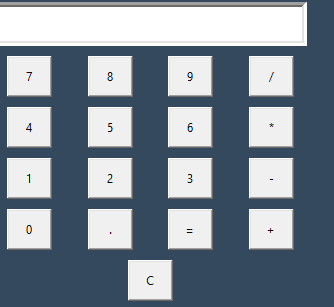
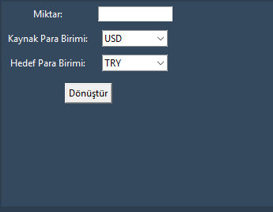

# Currency Converter & Calculator 💰🖩


## Description
A professional desktop application that combines a **Calculator** and a **Currency Converter**.  
It allows users to perform advanced calculations and convert currencies (USD, EUR, GBP, etc.) in real-time using the latest exchange rates.

## Features
- Fully functional calculator with advanced operations
- Real-time currency conversion with live rates
- User-friendly GUI with modern color theme
- Operation history tracking with statistics
- Professional and clean design suitable for portfolios

## Screenshots



## Installation
1. Clone the repository:  
```bash
git clone git@github.com:YourGitHubUsername/Currency-Converter-Calculator.git
Install dependencies:

pip install requests matplotlib

Run the app:

python main.py
## Usage

Enter numbers and operations in the calculator

Select currency type and enter amount in the converter

View calculation history and statistics

Enjoy a professional, interactive GUI

## License

This project is licensed under the MIT License. See LICENSE
 for details.

## Contact

For questions or collaboration, reach out via GitHub issues or email: your.email@example.com
